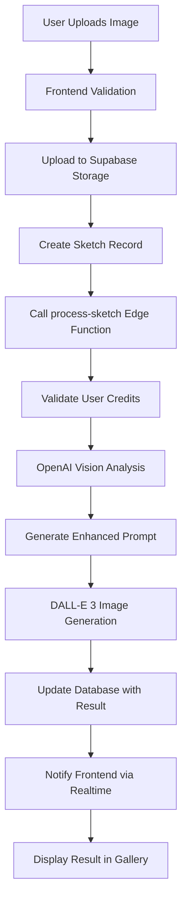

# PixieSketch AI - Architecture Analysis & Error Report

## Application Overview

PixieSketch AI is a web application that transforms children's drawings into magical animated images using AI. The application allows users to upload drawings, apply different artistic styles (cartoon, Pixar, realistic), and receive transformed images through a credit-based payment system.

## Technology Stack

### Frontend

- **Framework**: React 18.3.1 with TypeScript
- **Build Tool**: Vite 5.4.1
- **UI Components**: Radix UI components with custom shadcn/ui implementation
- **Styling**: Tailwind CSS with animations
- **State Management**: React Query (@tanstack/react-query) for server state
- **Routing**: React Router DOM 6.26.2
- **Forms**: React Hook Form with Zod validation

### Backend

- **Database**: Supabase (PostgreSQL)
- **Authentication**: Supabase Auth
- **Storage**: Supabase Storage for image uploads
- **Serverless Functions**: Supabase Edge Functions (Deno runtime)
- **AI Integration**: OpenAI API (GPT-4o-mini for analysis, DALL-E 3 for image generation)

### Deployment

- **Frontend**: Vercel
- **Backend**: Supabase (hosted)
- **Domain**: pixiesketch.com

## Core Features

### 1. User Authentication

- Google OAuth integration via Supabase Auth
- Session management with automatic token refresh
- Admin access for specific user (diogo@diogoppedro.com)

### 2. Image Upload & Processing

- File upload with validation (image types, 50MB limit)
- Preview functionality before processing
- Three transformation presets:
  - **Cartoon**: Clean 2D hand-drawn cartoon style
  - **Pixar**: 3D Pixar-style character transformation
  - **Realistic**: Semi-realistic storybook illustration

### 3. Credit System

- Tiered pricing model ($1, $4.99, $9.99)
- Credit deduction after successful image generation
- Real-time credit balance display
- Admin credit management

### 4. Payment Integration

- Stripe payment processing
- Multiple payment tiers
- Payment history tracking
- Webhook handling for payment verification

### 5. Gallery Management

- Sketch history with status tracking
- Real-time updates via Supabase subscriptions
- Download functionality
- Retry mechanism for failed transformations
- Delete functionality

### 6. Admin Dashboard

- User management
- Credit system oversight
- Payment history monitoring
- System health checks

## Architecture Flow

## Database Schema

### Tables

1. **profiles**

   - id (UUID, Primary Key)
   - email (String)
   - credits (Integer)
   - created_at, updated_at (Timestamps)

2. **sketches**
   - id (UUID, Primary Key)
   - user_id (Foreign Key to profiles)
   - name (String)
   - original_image_url (String)
   - animated_image_url (String)
   - status (String: processing, completed, failed)
   - is_new (Boolean)
   - created_at, updated_at (Timestamps)

### Functions

- `check_budget_limit`: Validates system-wide budget limits
- `deduct_user_credit`: Deducts credits from user profile
- `get_user_credits`: Retrieves current credit balance
- `log_credit_usage`: Logs credit transactions

## Edge Functions

### 1. process-sketch

**Location**: `supabase/functions/process-sketch/index.ts`
**Purpose**: Main image processing pipeline
**Steps**:

1. Authentication validation
2. Credit verification
3. Budget limit check
4. OpenAI Vision API call for analysis
5. Enhanced prompt generation
6. DALL-E 3 image generation
7. Database update and credit deduction

### 2. analyze-drawing

**Location**: `supabase/functions/analyze-drawing/index.ts`
**Purpose**: Alternative drawing analysis endpoint
**Features**:

- Rate limiting (10 requests/minute)
- Response caching (5 minutes TTL)
- GPT-4o model for analysis

### 3. create-payment

**Purpose**: Initiates Stripe checkout sessions

### 4. stripe-webhook

**Purpose**: Handles Stripe payment events

### 5. verify-payment

**Purpose**: Verifies payment completion

### 6. send-email

**Purpose**: Email notifications via Resend

### 7. admin-operations

**Purpose**: Admin-specific operations

## Identified Issues & Potential Error Sources

### 1. Image Generation Errors

#### Issue A: OpenAI API Failures

**Location**: `process-sketch/openai-service.ts`
**Potential Causes**:

- Missing or invalid OpenAI API key
- Rate limiting from OpenAI
- Invalid image format or size
- Network connectivity issues
- OpenAI service outages

**Error Handling**: Currently implemented with fallback mechanism, but may need improvement.

#### Issue B: Base64 Image Processing

**Location**: `process-sketch/index.ts` (lines 167-177)
**Potential Causes**:

- Large images exceeding memory limits
- Invalid base64 encoding
- Image format not supported by OpenAI

**Current Limit**: 67MB base64 encoded (50MB original)

#### Issue C: CORS Configuration

**Location**: `supabase/functions/_shared/cors.ts`
**Potential Issues**:

- Missing production domains in allowed origins
- CORS preflight failures
- Cross-origin cookie handling

### 2. Credit System Issues

#### Issue A: Race Conditions

**Location**: `process-sketch/credit-service.ts`
**Potential Problem**: Credit deduction without proper locking may lead to inconsistent states

#### Issue B: Failed Processing Credit Handling

**Current Behavior**: Credits only deducted after successful processing
**Issue**: If processing fails after OpenAI API calls, costs are incurred but credits aren't deducted

### 3. Real-time Subscription Issues

#### Issue A: Connection Stability

**Location**: `src/hooks/sketch/useSketchSubscription.ts`
**Potential Problems**:

- WebSocket connection drops
- Subscription cleanup issues
- Multiple subscription instances

### 4. File Upload Issues

#### Issue A: Storage Bucket Permissions

**Location**: `src/components/FileUpload.tsx`
**Potential Problems**:

- RLS policies blocking uploads
- Storage bucket not existing
- File size exceeding limits

## Security Considerations

1. **API Key Exposure**: OpenAI API key stored in environment variables
2. **Authentication**: Proper JWT validation in all Edge Functions
3. **File Upload**: File type and size validation
4. **Rate Limiting**: Implemented in multiple layers
5. **CORS**: Properly configured for production domains

## Performance Considerations

1. **Image Processing**: Heavy reliance on external APIs
2. **Real-time Updates**: Multiple subscriptions may impact performance
3. **Gallery Loading**: Pagination not implemented
4. **Base64 Encoding**: Memory intensive for large images

## Recommendations

### 1. Error Handling Improvements

- Implement more granular error reporting
- Add retry mechanisms with exponential backoff
- Improve error messages for user clarity

### 2. Monitoring & Logging

- Add structured logging throughout the application
- Implement error tracking (e.g., Sentry)
- Add performance monitoring for API calls

### 3. Image Processing Optimization

- Implement image compression before processing
- Add progress indicators for long-running operations
- Consider streaming for large file uploads

### 4. Credit System Enhancement

- Implement proper transaction handling
- Add credit expiration functionality
- Improve admin credit management tools

### 5. Scalability Improvements

- Add pagination to gallery
- Implement caching for frequently accessed data
- Consider CDN for image delivery

## Current Deployment Status

- **Frontend**: Deployed on Vercel (https://pixiesketch.com)
- **Backend**: Supabase project (uihnpebacpcndtkdizxd)
- **Edge Functions**: Deployed on Supabase
- **Domain**: Custom domain configured with SSL

## Most Likely Image Generation Error Causes

Based on the codebase analysis, image generation errors are most likely caused by:

1. **OpenAI API Key Issues**: Missing or invalid API key in Supabase environment
2. **Image Format Problems**: Invalid base64 encoding or unsupported image formats
3. **Rate Limiting**: Exceeding OpenAI API rate limits
4. **Network Timeout**: Long processing times exceeding Edge Function timeout limits
5. **CORS Issues**: Cross-origin request blocking between frontend and Edge Functions

## Next Steps for Debugging

1. Check Supabase Edge Function logs for detailed error messages
2. Verify OpenAI API key is properly set in Supabase environment
3. Test image generation with small, simple images
4. Monitor credit deduction behavior during failed attempts
5. Check real-time subscription status updates
